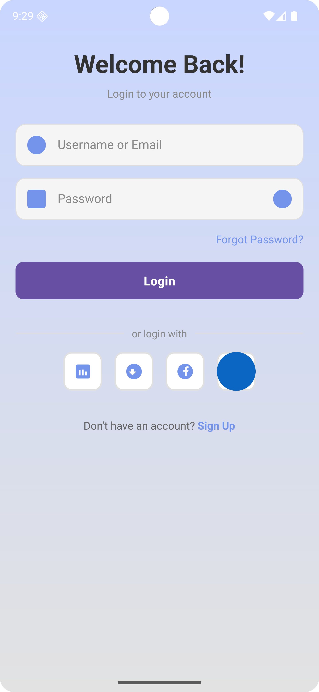
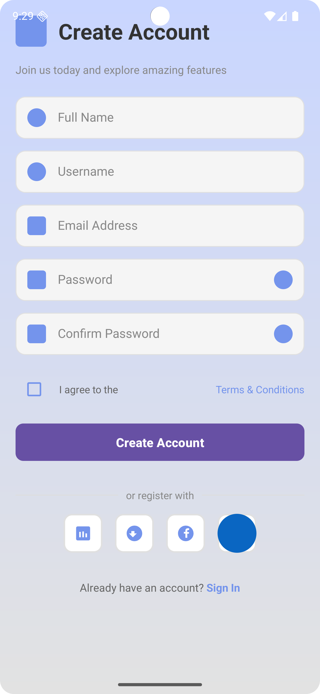
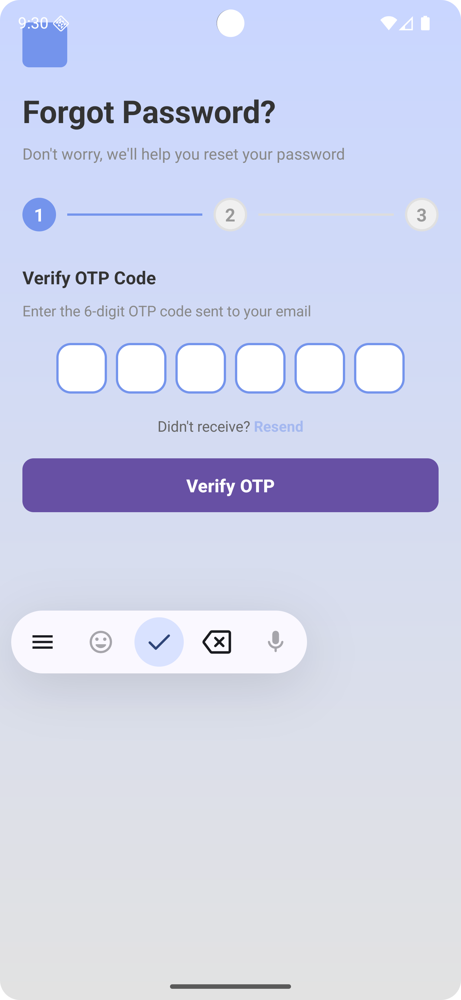
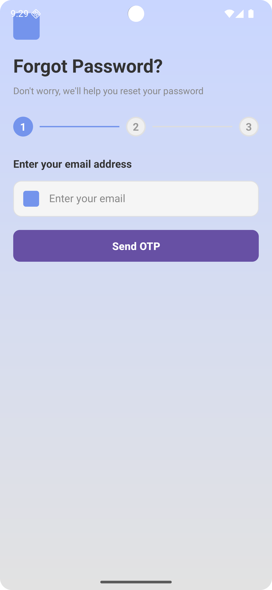

# Nhom02_BT01

Đây là một dự án ứng dụng Android đơn giản bao gồm chức năng đăng nhập, đăng ký tài khoản được kích hoạt bằng OTP qua email và quên mật khẩu bằng OTP qua email.

## 📱 Ảnh chụp màn hình

|        Màn hình đăng nhập         |         Màn hình đăng ký          |           Màn hình OTP            |      Màn hình quên mật khẩu       |
| :-------------------------------: | :-------------------------------: | :-------------------------------: | :-------------------------------: |
|  |  |  |  |

## ✨ Tính năng

- **Màn hình đăng nhập:** Cho phép người dùng đăng nhập bằng thông tin tài khoản của họ.

  - Nhập username/email và password
  - Toggle hiển thị/ẩn mật khẩu
  - Link "Quên mật khẩu?" để đặt lại mật khẩu
  - Link "Đăng ký" để tạo tài khoản mới
  - Nút đăng nhập với các mạng xã hội (Google, Facebook, Github, LinkedIn)

- **Màn hình đăng ký:** Cho phép người dùng mới đăng ký tài khoản.

  - Nhập Họ tên, Tên đăng nhập, Email, Mật khẩu, Xác nhận mật khẩu
  - Toggle hiển thị/ẩn mật khẩu
  - Checkbox đồng ý với Điều khoản & Điều kiện
  - Validation đầu vào
  - Nút đăng ký với các mạng xã hội

- **Màn hình xác minh OTP:** Tài khoản mới được kích hoạt thông qua mã OTP được gửi đến địa chỉ email của người dùng.

  - Nhập mã OTP 6 chữ số
  - Auto-focus chuyển sang ô tiếp theo
  - Support backspace quay lại ô trước
  - Countdown timer 30 giây
  - Nút "Gửi lại mã OTP"
  - Link "Thay đổi email"

- **Màn hình quên mật khẩu:** Cho phép người dùng đặt lại mật khẩu thông qua mã OTP được gửi đến địa chỉ email của họ.

  - **Bước 1:** Nhập email để nhận mã OTP
  - **Bước 2:** Nhập mã OTP 6 chữ số (tương tự màn hình xác minh)
  - **Bước 3:** Tạo mật khẩu mới và xác nhận
  - Step indicator hiển thị tiến độ (1/2/3)
  - Có thể quay lại bước trước

- **Điều hướng:** Điều hướng cơ bản giữa các màn hình bằng Intent.

## 🛠️ Công nghệ sử dụng

- **Android Studio** - IDE phát triển
- **Java** - Ngôn ngữ lập trình
- **XML** - Định nghĩa giao diện người dùng
- **Material Design** - Thiết kế giao diện

## 📋 Yêu cầu

- Android 5.0 (API level 21) hoặc cao hơn
- Android Studio 4.0 hoặc cao hơn

## 🚀 Cài đặt

1.  Clone repository này.
2.  Mở dự án trong Android Studio.
3.  Đợi Gradle sync xong.
4.  Chạy ứng dụng trên trình giả lập (AVD) hoặc thiết bị vật lý.

## 🎨 Màu sắc

- **Màu chính:** `#7494ec` (Xanh)
- **Nền:** Gradient từ `#e2e2e2` đến `#c9d6ff`
- **Text chính:** `#333333` (Xám đậm)
- **Text phụ:** `#888888` (Xám trung bình)

## 📝 Hướng dẫn sử dụng

### Đăng nhập

1. Nhập tên đăng nhập hoặc email
2. Nhập mật khẩu
3. Bấm nút "Đăng nhập"

### Đăng ký

1. Bấm "Đăng ký" trên màn hình đăng nhập
2. Nhập các thông tin bắt buộc
3. Đồng ý với Điều khoản & Điều kiện
4. Bấm "Tạo tài khoản"
5. Nhập mã OTP được gửi đến email của bạn
6. Bấm "Xác minh OTP"

### Quên mật khẩu

1. Bấm "Quên mật khẩu?" trên màn hình đăng nhập
2. Nhập địa chỉ email của bạn
3. Bấm "Gửi OTP"
4. Nhập mã OTP được gửi đến email
5. Bấm "Xác minh OTP"
6. Tạo mật khẩu mới
7. Bấm "Đặt lại mật khẩu"

## 🔄 Luồng điều hướng

```
LoginActivity (Màn hình chính)
    ↓
    ├─→ "Đăng ký" → RegisterActivity
    │        ↓
    │    Đăng ký thành công
    │        ↓
    │   OTPVerificationActivity
    │        ↓
    │    OTP xác minh thành công
    │        ↓
    │   Quay lại LoginActivity
    │
    └─→ "Quên mật khẩu?" → ForgotPasswordActivity
             ↓
         Bước 1: Nhập email
             ↓
         Bước 2: Xác minh OTP
             ↓
         Bước 3: Đặt lại mật khẩu
             ↓
         Quay lại LoginActivity
```

## 🎯 Cải thiện trong tương lai

- [ ] Kết nối backend API
- [ ] Xác thực sinh trắc học (Biometric)
- [ ] Chế độ tối (Dark mode)
- [ ] Đa ngôn ngữ (Localization)
- [ ] Bộ nhớ cache thông tin người dùng
- [ ] Xử lý mạng tốt hơn (Offline mode)
---

**Cảm ơn bạn đã sử dụng ứng dụng này!** 🎉
